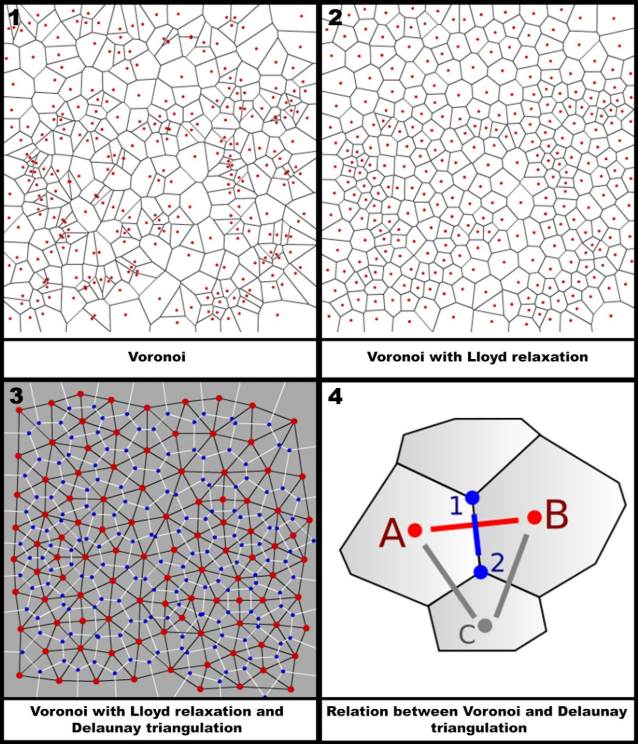

# delaunay-triangulation-island
This repository includes a delaunay triangulation algoritm that generates an island. The project is created in Unity 3D 2019.2.6f1

link to video: https://drive.google.com/file/d/1it__gd7-71rQEvTunlRVkIgCSaCqkZS7/view?usp=sharing

    

    

  

